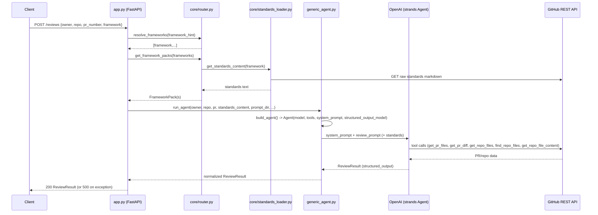
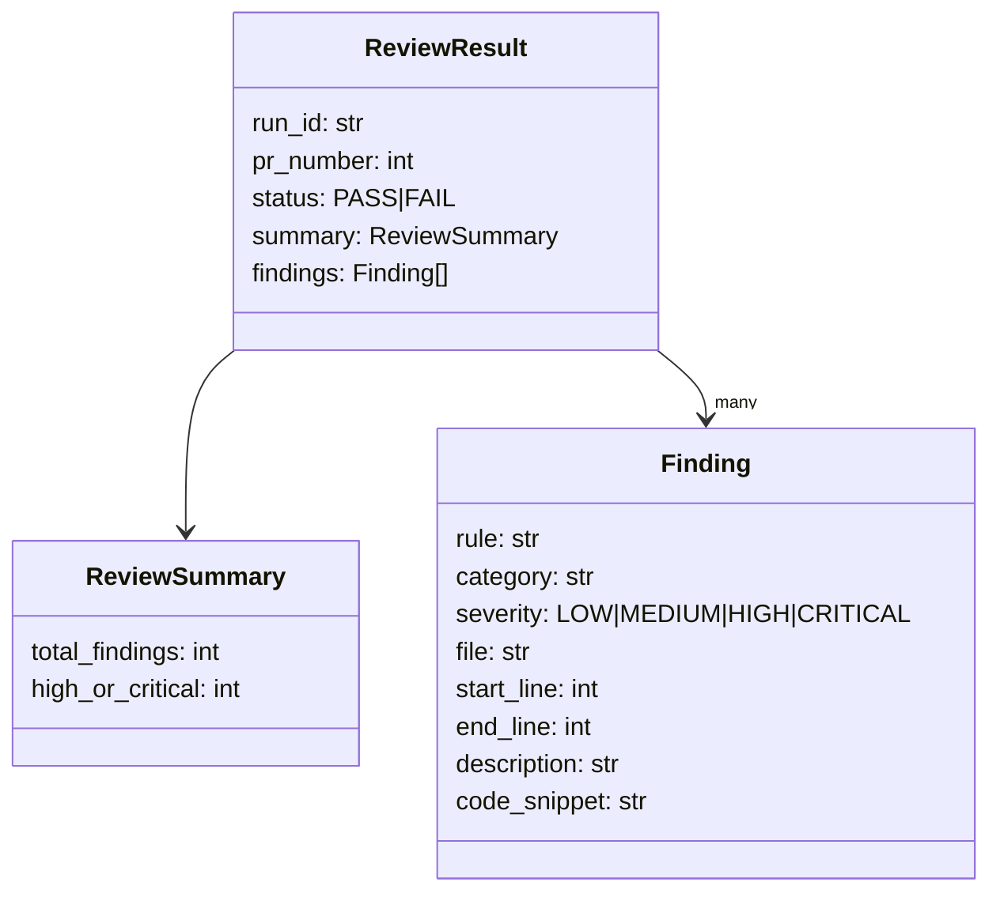

# code-review-agent-platform

A generic, API-first code review platform that reviews GitHub pull requests against domain-specific coding standards (.NET, Python, React, QA, Database) using an LLM agent, and returns a structured pass/fail result with findings.

The goal is to keep the review engine domain-agnostic while loading domain-specific review packs and standards at runtime.

## What this repo owns

- API contract for triggering a review
- Shared review result schema
- Domain routing and selection
- Provider integrations such as GitHub PR/diff/file access

## How to Run

### 1. Install dependencies

```bash
python3 -m venv .venv
source .venv/bin/activate
pip install -r requirements.txt
```

### 2. Configure secrets

Create a `.env` file in the project root (gitignored, not committed):

```
OPENAI_API_KEY=sk-...
GITHUB_TOKEN=github_pat_...
```

Optional settings (see [config.py](config.py) for defaults): `OPENAI_MODEL`, `LOG_LEVEL`, `REQUEST_TIMEOUT`.

### 3a. Run as an API server

```bash
uvicorn app:app --reload --host 127.0.0.1 --port 8000
```

Docs UI: `http://127.0.0.1:8000/docs`

```bash
curl -X POST http://127.0.0.1:8000/reviews \
  -H "Content-Type: application/json" \
  -d '{"owner":"OWNER","repo":"REPO","pr_number":29}'
```

`framework` is optional in the request body: `auto` (default), `dotnet`, `python`, `react`, `qa`, `database`, or comma-separated for multi-domain (e.g. `"python,qa"`).

A ready-to-import Postman collection with example requests for every domain is at [api/postman_collection.json](api/postman_collection.json).

### 3b. Run as a CLI (no server needed)

```bash
python run_agent.py --owner OWNER --repo REPO --pr 29 --framework dotnet
```

Prints the `ReviewResult` JSON to stdout. Note: `--framework` defaults to `dotnet` here, vs `auto` for the API (see observation #10 below).

### Run tests

```bash
python -m pytest -q
```

## Contract shape

This platform uses the same final review result shape as the current .NET agent:

- `run_id`
- `pr_number`
- `status`
- `summary.total_findings`
- `summary.high_or_critical`
- `findings[]`

That keeps the output stable while the input trigger becomes API-driven.

## Folder layout

```text
code-review-agent-platform/
├── api/
│   ├── openapi.yaml
│   └── postman_collection.json
├── core/
├── domains/
│   ├── dotnet/
│   ├── python/
│   ├── react/
│   ├── qa/
│   └── database/
├── tools/
├── tests/
└── README.md
```

## Architecture & Implementation

### High-Level Flow



### Entry Points

| Entry point | Purpose |
|---|---|
| [app.py](app.py) | FastAPI service exposing `POST /reviews`. |
| [run_agent.py](run_agent.py) | CLI runner for local/manual review runs (`--owner --repo --pr --framework`). |
| [api/openapi.yaml](api/openapi.yaml) | Documented contract, including endpoints not yet implemented (see below). |

Both `app.py` and `run_agent.py` converge on the same core pipeline: `core/router.py` → `core/standards_loader.py` → `generic_agent.run_agent`.

### Core Components

#### `core/router.py` — Framework resolution & pack loading
- `resolve_frameworks(repo_files, framework_hint)`: if a hint other than `"auto"` is given, splits it on commas (supports multi-domain reviews, e.g. `"python,qa"`). If `"auto"`, infers from repo file names: `package.json`/`vite.config`/`next.config` → react, `requirements.txt`/`pyproject.toml`/`setup.py` → python, `.sln`/`.csproj` → dotnet, `playwright.config`/`cypress.config`/`/e2e/` → qa, `.sql`/`.sqlproj`/`/migrations/` → database. Defaults to `dotnet` if nothing matches.
- `resolve_frameworks_for_repo(owner, repo, framework_hint)`: the entry point `app.py`/`run_agent.py` actually call. When the hint is `"auto"`, it fetches the repo's real file tree via `tools.github_tools.list_repo_file_paths` and feeds it into `resolve_frameworks`, so auto-detection reflects the actual repo contents instead of always falling back to `dotnet`. Falls back to `["dotnet"]` if the GitHub fetch fails.
- `get_framework_pack(framework)`: maps a framework name to a `FrameworkPack` (name, prompt dir under `domains/<name>/prompts`, module name — always `"generic_agent"`, and standards content fetched via `get_standards_content`).
- `combine_standards(packs)`: concatenates standards text from multiple packs under `## <name>` headers, used for multi-domain reviews.
- Supported domains: `python`, `react`, `qa`/`quality-assurance`, `database`/`db`/`mssql`, and default `dotnet`.
- Detection is filename-heuristic only (no LLM call) — deliberate cost/latency tradeoff, since manifest/config files are reliable signals. Worth revisiting only if a repo's framework is genuinely ambiguous from file names alone.

#### `core/standards_loader.py` — Remote standards fetch
- `get_standards_content(framework, standards_repo_url=None)`: maps framework → file path in the `best-practices` repo (e.g. `backend/python-standards.md`, `qa/playwright-standards.md`), builds a raw GitHub URL, and does a blocking `requests.get` (10s timeout) each call. No caching. Raises on network failure (`response.raise_for_status()` / `requests.RequestException`).
- Default repo: `https://raw.githubusercontent.com/cjdava/best-practices/main`, overridable via `STANDARDS_REPO_URL` env var.

#### `generic_agent.py` — Agent construction & execution
Domain-agnostic; all domains reuse this module (only the `prompt_dir` and `standards_content` differ).

- **Models** (Pydantic):
  - `Finding`: rule, category, severity (`LOW|MEDIUM|HIGH|CRITICAL`), file, start_line/end_line (`>=1`, validated `end_line >= start_line`), description, code_snippet.
  - `ReviewSummary`: total_findings, high_or_critical.
  - `ReviewResult`: run_id, pr_number, status (`PASS|FAIL`), summary, findings[].
- **Prompt building**:
  - `build_system_prompt(prompt_dir)`: reads `system_prompt.md` from the domain's prompt dir (defaults to `prompts/` under the repo root if none given/exists).
  - `build_review_prompt(owner, repo, pr_number, standards_content, prompt_dir)`: reads `review_prompt.md`, formats `{owner}/{repo}/{pr_number}` placeholders, appends a `Standards:` block if provided.
- **`build_agent(prompt_dir, review_domain)`**: constructs a `strands.Agent` with:
  - Model: `OpenAIModel` (`settings.openai_model`, temperature 0, seed 42 — deterministic).
  - Tools: `get_pr_files`, `get_pr_diff`, `get_repo_files`, `find_repo_files`, `get_repo_file_content` (all from `tools/github_tools.py`).
  - `structured_output_model=ReviewResult` — forces the LLM response into the schema.
  - `callback_handler=None`, `load_tools_from_directory=False`.
- **`normalize_review_result(result, run_id, pr_number)`**: de-duplicates findings by `(file, start_line, rule)`, sorts them, recomputes `high_or_critical` count and `status` (`FAIL` if any HIGH/CRITICAL) — i.e., the LLM-provided status/summary are discarded and recomputed server-side (good: don't trust LLM arithmetic).
- **`run_agent(...)`**: orchestrates build → invoke → normalize. Raises `ValueError` if `result.structured_output` is `None`.

#### `tools/github_tools.py` — GitHub REST integration (agent tool calls)
All tools use `@tool(context=True)` (strands), a shared `_github_headers()` (Bearer token from `settings.github_token`), and return a `{"status": "success"|"error", "content": [...]}` envelope.

| Tool | Endpoint | Notes |
|---|---|---|
| `get_pr_files` | `GET /repos/{owner}/{repo}/pulls/{pr}/files` | Returns filename/status/additions/deletions/changes only. |
| `get_pr_diff` | `GET /repos/{owner}/{repo}/pulls/{pr}` with diff Accept header | Truncates to first 8000 chars. |
| `get_repo_files` | `GET .../git/trees/HEAD?recursive=1` | Returns up to 1000 blob paths. |
| `find_repo_files` | same tree endpoint | Client-side filter by substring/suffix, limit clamped to 1000. |
| `get_repo_file_content` | `GET .../contents/{path}?ref=HEAD` | Base64-decodes content, truncates to `max_chars` (clamped ≤ 50000). |

#### `domains/<name>/prompts/` — Per-domain prompt packs
Each domain (`dotnet`, `python`, `react`, `qa`, `database`) has `system_prompt.md` (persona, rules, severity rubric, mandatory workflow) and `review_prompt.md` (per-PR instructions/template). The `.NET` pack is the most developed — it has an explicit multi-step workflow for test-coverage/dependency analysis using `.sln`/`.csproj` inspection.

#### `config.py` — Settings
`pydantic-settings` `Settings` loaded from `.env`: `openai_api_key` (SecretStr, required), `github_token` (SecretStr, required), `openai_model` (default `gpt-4.1-mini`), `log_level` (default `INFO`), `request_timeout` (default 30s).

#### `api/openapi.yaml` — API contract
Documents `POST /reviews` (sync `200` or async `202`) and `GET /reviews/{run_id}`. Only `POST /reviews` returning `200` synchronously is implemented in [app.py](app.py); async acceptance and the `GET` lookup are not implemented.

### Data Model Summary



Note: this schema is duplicated in three places — `generic_agent.py`, `app.py`, and `api/openapi.yaml` — and must be kept in sync manually.

### Tests

- [tests/test_router.py](tests/test_router.py): framework detection/resolution, pack construction for `qa`/`database`, multi-framework resolution.
- [tests/test_standards_loader.py](tests/test_standards_loader.py): only covers the network-failure path.
- No tests exist for `generic_agent.py`, `app.py`, or `tools/github_tools.py`.

## Observations & Improvement Opportunities

These are things worth reviewing/discussing, not yet changed:

1. **Error handling leaks internals**: [app.py](app.py) `create_review` catches `Exception` broadly and returns `str(exc)` as the HTTP 500 detail — this can leak stack/internal info to API callers (OWASP A05/A09). Consider logging the full exception server-side and returning a generic message to clients.
2. **No authentication/authorization** on `POST /reviews` in `app.py` — anyone who can reach the service can trigger reviews (which consume OpenAI + GitHub API quota) and read repo content via the agent's tools. Consider an API key or OAuth layer.
3. **Dynamic import is dead code**: `app.py` does `module = __import__(primary_pack.module_name); runner = getattr(module, "run_agent")` but `module_name` is always `"generic_agent"` for every pack in `router.py`. This could just be a direct `generic_agent.run_agent` import/call.
4. **API contract vs implementation drift**: `api/openapi.yaml` documents `202` async responses and `GET /reviews/{run_id}`, but only synchronous `POST /reviews` exists. Either implement the async path or trim the spec to match reality.
5. **No caching for standards content**: `core/standards_loader.get_standards_content` does a blocking network fetch to GitHub on every single review request, with no retry/backoff/caching. This adds latency and a hard external dependency/failure point per request.
6. **Schema triplication**: `Finding`/`ReviewSummary`/`ReviewResult` are hand-duplicated in `generic_agent.py`, `app.py`, and `api/openapi.yaml`. A drift here (e.g., a new severity value) would silently break one layer. Consider sharing one Pydantic model set and generating the OpenAPI schema from it.
7. **Thin test coverage**: no tests exercise `generic_agent.run_agent`, `normalize_review_result` (dedup/status logic), the FastAPI endpoint, or the GitHub tool functions (including their error paths).
8. **Secrets in logs**: `logging.basicConfig(level=settings.log_level)` in `generic_agent.py` is fine, but there's no explicit redaction guard if request/response payloads (which could include tokens in headers via `requests` exceptions) are ever logged directly.
9. **Supply-chain trust on standards content**: standards markdown is fetched at runtime from a remote GitHub repo and injected directly into the LLM system/review prompt. If that upstream repo is compromised or the URL is overridden (`STANDARDS_REPO_URL` / CLI `--standards-repo-url`), arbitrary prompt content could be injected into the agent's instructions.
10. **`run_agent.py` default framework mismatch**: CLI defaults `--framework` to `dotnet` while `app.py`'s `ReviewRequest.framework` defaults to `"auto"` — inconsistent default behavior between the two entry points.

## Verified Working

- End-to-end run confirmed against a real PR (`POST /reviews` → GitHub tool calls → OpenAI structured output → normalized result) — returned `FAIL` with real findings, including a logged JWT flagged as CRITICAL.
- `requirements.txt` previously listed `strands` (an unrelated PyPI package that fails to build); fixed to `strands-agents`, the correct AWS Strands Agents SDK matching the `from strands import Agent` usage in the code.
- `ref="HEAD"` used by `tools/github_tools.py` against the GitHub Contents/Trees API was confirmed to work in practice during the test run.
- `framework: "auto"` now fetches the real repo file tree (via `resolve_frameworks_for_repo`) instead of always defaulting to `dotnet` — confirmed it correctly resolved `domain=dotnet` from a real `.sln`/`.csproj`-containing repo.